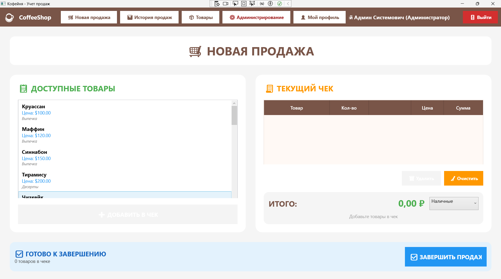
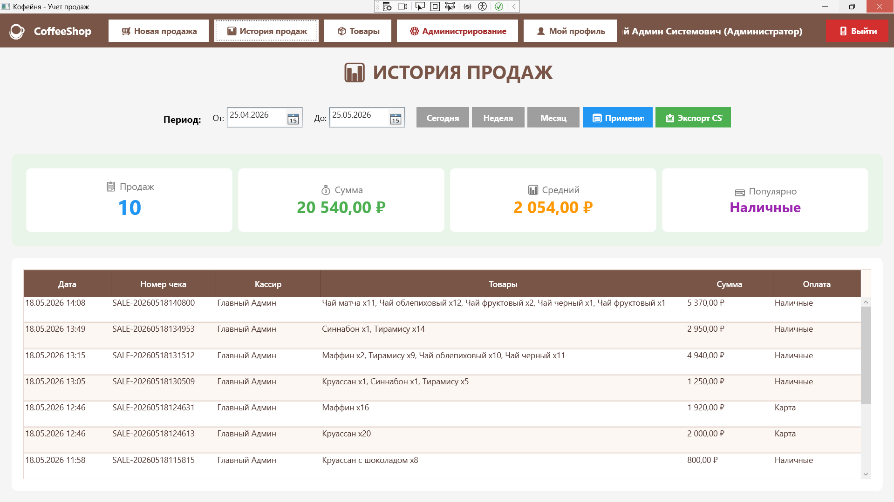
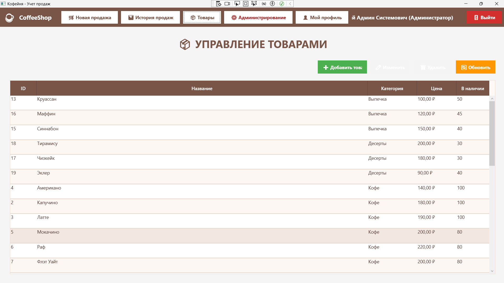

# CoffeeShop

Курсовая работа на тему: **«Автоматизация учета продаж в кофейне»**.

## Описание проекта

**CoffeeShop** — это настольное приложение для учета продаж в кофейне. Программа предназначена для сотрудников кофейни: кассиров, бариста, менеджеров и администратора. Система помогает вести список товаров, оформлять продажи, хранить историю чеков, просматривать статистику и управлять учетными записями сотрудников.

Приложение решает проблему ручного учета продаж: вместо записи заказов и подсчета выручки вручную пользователь может выбрать товары из каталога, добавить их в чек, указать способ оплаты и сохранить продажу в базе данных. После завершения продажи программа формирует Word-чек и сохраняет его на компьютер.

## Основные возможности

- авторизация сотрудников по логину и паролю;
- регистрация нового сотрудника;
- просмотр данных текущего пользователя;
- редактирование профиля сотрудника;
- создание новой продажи;
- добавление товаров в чек;
- изменение количества товара в чеке;
- выбор способа оплаты: наличные, карта, бесконтактная оплата;
- сохранение продажи в базе данных;
- автоматическое формирование Word-чека;
- просмотр истории продаж за выбранный период;
- просмотр общей статистики: количество продаж, сумма продаж, средний чек, популярный способ оплаты;
- экспорт истории продаж в CSV-файл;
- просмотр, добавление, редактирование и удаление товаров;
- панель администратора для просмотра сотрудников.

## Технологии

- Язык программирования: **C#**
- Интерфейс: **WPF**
- Платформа: **.NET Framework 4.7.2**
- База данных: **Microsoft SQL Server**
- Работа с БД: **ADO.NET / System.Data.SqlClient**
- Среда разработки: **Visual Studio**
- Система контроля версий: **Git / GitHub**

## Структура репозитория

```text
CoffeeShop/
├── README.md
├── db/
│   └── database.sql
├── docs/
│   └── сюда можно добавить пояснительную записку в PDF
├── screenshots/
│   └── сюда можно добавить скриншоты программы
└── src/
    ├── CoffeeShop.sln
    └── CoffeeShop/
        ├── App.config
        ├── App.xaml
        ├── MainWindow.xaml
        ├── Classes/
        ├── Pages/
        ├── Windows/
        └── Properties/
```

## Как развернуть и запустить проект

### 1. Установить необходимое ПО

Установите **Visual Studio Community** и при установке выберите нагрузку **«.NET desktop development»**.

Также установите:

- **SQL Server Express**;
- **SQL Server Management Studio (SSMS)**;
- **Git** — если проект будет загружаться на GitHub через командную строку.

### 2. Развернуть базу данных

1. Откройте **SQL Server Management Studio**.
2. Подключитесь к серверу. Обычно используется один из вариантов:

```text
.\SQLEXPRESS
(localdb)\MSSQLLocalDB
localhost\SQLEXPRESS
```

3. Нажмите кнопку **New Query**.
4. Откройте файл:

```text
db/database.sql
```

5. Нажмите **Execute**.
6. После выполнения скрипта должна появиться база данных:

```text
CoffeeShopDB
```

### 3. Настроить строку подключения

Откройте файл:

```text
src/CoffeeShop/App.config
```

Проверьте строку подключения:

```xml
<connectionStrings>
  <add name="CoffeeShopDB"
       connectionString="Server=.\SQLEXPRESS;Database=CoffeeShopDB;Integrated Security=True;"
       providerName="System.Data.SqlClient" />
</connectionStrings>
```

Если у вас другое имя SQL Server, замените значение `Server` на свое. Например:

```text
Server=(localdb)\MSSQLLocalDB;Database=CoffeeShopDB;Integrated Security=True;
```

### 4. Открыть проект в Visual Studio

1. Откройте папку проекта.
2. Перейдите в папку `src/`.
3. Откройте файл:

```text
CoffeeShop.sln
```

4. Дождитесь загрузки проекта.
5. Нажмите **Build → Build Solution**.
6. Нажмите **F5** или кнопку **Пуск**.

### 5. Вход в программу

После запуска откроется окно авторизации.

Тестовые учетные записи из файла `database.sql`:

```text
Администратор:
логин: admin
пароль: admin123

Кассир:
логин: cashier
пароль: cashier123
```

Администратор видит дополнительную кнопку **«Администрирование»**.

## Работа с программой

### Авторизация

1. Введите логин и пароль.
2. Нажмите кнопку **«Войти»**.
3. После успешного входа откроется главное окно программы.

### Регистрация сотрудника

1. На странице входа нажмите **«Регистрация нового сотрудника»**.
2. Заполните логин, пароль, ФИО, должность, телефон и email.
3. Нажмите **«Зарегистрировать»**.
4. После регистрации сотрудник сможет войти в программу.

### Создание продажи

1. Откройте раздел **«Новая продажа»**.
2. В списке товаров выберите нужный товар.
3. Нажмите **«Добавить в чек»**.
4. При необходимости измените количество товара кнопками `+` и `-` или ползунком.
5. Выберите способ оплаты.
6. Нажмите кнопку завершения продажи.
7. Продажа будет сохранена в базе данных, а Word-чек будет создан в папке:

```text
Документы\CoffeeShopReceipts
```

### Работа с товарами

1. Откройте раздел **«Товары»**.
2. Чтобы добавить товар, нажмите **«Добавить»**, заполните название, цену и категорию, затем нажмите **«Сохранить»**.
3. Чтобы изменить товар, выберите строку в таблице и нажмите **«Редактировать»**.
4. Чтобы удалить товар, выберите строку и нажмите **«Удалить»**.

Удаление товара выполняется мягко: товар не удаляется физически из базы данных, а получает признак `IsActive = 0`.

### История продаж

1. Откройте раздел **«История продаж»**.
2. Выберите период вручную или нажмите **«Сегодня»**, **«Неделя»**, **«Месяц»**.
3. Нажмите **«Применить»**.
4. В таблице появятся продажи за выбранный период.
5. Для сохранения отчета нажмите **«Экспорт CSV»**.

CSV-файл сохраняется на рабочий стол.

### Профиль пользователя

1. Откройте раздел **«Мой профиль»**.
2. Измените ФИО, должность, телефон, email или пароль.
3. Нажмите **«Сохранить»**.

### Администрирование

Раздел доступен пользователю с должностью **«Администратор»**.

В разделе отображается список сотрудников: логин, ФИО, должность, телефон и email. Также можно открыть окно регистрации нового сотрудника.

## Скриншоты

Добавьте скриншоты интерфейса в папку `screenshots/` и укажите их в этом разделе.

```markdown



```

## Как загрузить проект на GitHub

### Вариант 1. Через сайт GitHub

1. Создайте новый публичный репозиторий на GitHub.
2. Назовите его, например:

```text
kursovaya-coffeeshop-familiya
```

3. Откройте созданный репозиторий.
4. Нажмите **Add file → Upload files**.
5. Перетащите файлы и папки проекта.
6. Нажмите **Commit changes**.

### Вариант 2. Через Git

В папке проекта выполните команды:

```bash
git init
git add .
git commit -m "Добавлен курсовой проект CoffeeShop"
git branch -M main
git remote add origin https://github.com/USERNAME/kursovaya-coffeeshop-familiya.git
git push -u origin main
```

Вместо `USERNAME` укажите свой логин GitHub.

## Важные замечания

- В учебном проекте пароли хранятся в открытом виде. В реальной системе их нужно хранить в виде хеша.
- Если при запуске появляется ошибка подключения к БД, проверьте имя сервера в `App.config`.
- Если кнопка администрирования не отображается, войдите под пользователем `admin` или назначьте сотруднику должность `Администратор`.
- Для корректной работы программы база данных `CoffeeShopDB` должна быть создана до запуска приложения.

## Автор

```text
ФИО: указать своё ФИО
Группа: указать группу
Учебное заведение: указать учебное заведение
```
